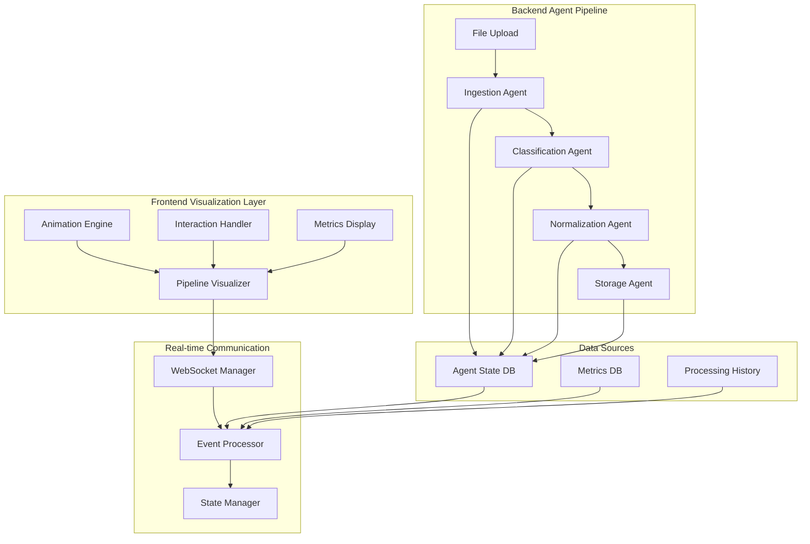

# Design Document

## Overview

This design outlines an interactive, real-time visualization system for the agentic data processing pipeline. The system provides users with a comprehensive view of how their uploaded data flows through different AI agents, showing decision-making processes, data transformations, and performance metrics in an engaging and educational interface.

## Architecture

### High-Level Visualization Architecture



### Technology Stack

- **Frontend**: React/Next.js with Canvas API or SVG for visualizations
- **Animation**: Framer Motion or React Spring for smooth animations
- **Real-time**: WebSocket connections for live updates
- **State Management**: Zustand or Redux Toolkit for complex state
- **Visualization**: D3.js or custom Canvas-based rendering
- **Backend**: FastAPI with WebSocket support and LangGraph agent integration

## Components and Interfaces

### 1. Pipeline Visualizer Component

**Purpose**: Main visualization component showing the complete agent pipeline

**Interface**:
```typescript
interface PipelineVisualizerProps {
  fileId: string
  processingState: ProcessingState
  onStepClick: (stepId: string) => void
  viewMode: 'detailed' | 'simplified'
  showMetrics: boolean
}

interface ProcessingState {
  currentStep: string
  steps: AgentStep[]
  overallProgress: number
  estimatedTimeRemaining: number
  errors: ProcessingError[]
}

interface AgentStep {
  id: string
  name: string
  description: string
  status: 'pending' | 'active' | 'completed' | 'error' | 'retrying'
  progress: number
  startTime?: Date
  endTime?: Date
  confidence?: number
  decision?: AgentDecision
  metrics: StepMetrics
}
```

**Visual Layout**:
```
┌─────────────────────────────────────────────────────────────┐
│                    Pipeline Visualization                    │
├─────────────┬─────────────┬─────────────┬─────────────────┤
│   Upload    │  Ingestion  │Classification│  Normalization  │
│   Agent     │   Agent     │    Agent     │     Agent       │
│             │             │              │                 │
│   [████]    │   [██░░]    │    [░░░░]    │     [░░░░]      │
│   100%      │    45%      │     0%       │      0%         │
│             │             │              │                 │
│  ✓ Complete │ ⚡ Active   │  ⏳ Pending  │   ⏳ Pending    │
└─────────────┴─────────────┴─────────────┴─────────────────┘
│                                                             │
│  📊 Confidence: 95%  ⏱️ Est. Time: 2m 30s  📈 Throughput   │
└─────────────────────────────────────────────────────────────┘
```

### 2. Agent Step Component

**Purpose**: Individual agent visualization with detailed information

**Interface**:
```typescript
interface AgentStepProps {
  step: AgentStep
  isActive: boolean
  onClick: () => void
  showDetails: boolean
  animationSpeed: number
}

interface AgentDecision {
  classification: string
  confidence: number
  reasoning: string[]
  alternativeOptions: string[]
  usedLLM: boolean
  processingTime: number
}

interface StepMetrics {
  processingTime: number
  memoryUsage: number
  cpuUsage: number
  throughput: number
  errorCount: number
}
```

### 3. Data Flow Animation Component

**Purpose**: Animated visualization of data flowing between agents

**Interface**:
```typescript
interface DataFlowAnimationProps {
  fromStep: string
  toStep: string
  dataType: 'structured' | 'unstructured' | 'metadata'
  isActive: boolean
  speed: number
}

interface FlowParticle {
  id: string
  position: { x: number; y: number }
  velocity: { x: number; y: number }
  type: 'data' | 'decision' | 'error'
  color: string
  size: number
}
```

### 4. Decision Explanation Panel

**Purpose**: Detailed explanation of agent decisions and reasoning

**Interface**:
```typescript
interface DecisionExplanationProps {
  decision: AgentDecision
  inputData: DataSample
  outputData: DataSample
  isVisible: boolean
  onClose: () => void
}

interface DataSample {
  preview: string
  schema: Record<string, any>
  rowCount: number
  confidence: number
}
```

### 5. Multi-file Processing Manager

**Purpose**: Manages visualization for multiple concurrent file uploads

**Interface**:
```typescript
interface MultiFileProcessorProps {
  files: ProcessingFile[]
  layout: 'grid' | 'list' | 'carousel'
  maxConcurrent: number
}

interface ProcessingFile {
  id: string
  name: string
  size: number
  type: string
  processingState: ProcessingState
  priority: number
}
```

## Data Models

### Processing Event Model
```typescript
interface ProcessingEvent {
  id: string
  fileId: string
  agentId: string
  eventType: 'started' | 'progress' | 'decision' | 'completed' | 'error'
  timestamp: Date
  data: Record<string, any>
  metadata: EventMetadata
}

interface EventMetadata {
  confidence?: number
  processingTime?: number
  memoryUsage?: number
  errorDetails?: string
  retryCount?: number
}
```

### Visualization State Model
```typescript
interface VisualizationState {
  activeFiles: Map<string, ProcessingState>
  selectedStep: string | null
  viewMode: 'detailed' | 'simplified'
  animationSpeed: number
  showMetrics: boolean
  filters: VisualizationFilters
}

interface VisualizationFilters {
  showOnlyErrors: boolean
  hideCompletedSteps: boolean
  agentTypes: string[]
  timeRange: { start: Date; end: Date }
}
```

### Historical Processing Model
```typescript
interface ProcessingHistory {
  id: string
  fileId: string
  fileName: string
  uploadTime: Date
  completionTime: Date
  totalProcessingTime: number
  steps: CompletedAgentStep[]
  finalClassification: string
  success: boolean
}

interface CompletedAgentStep {
  agentId: string
  startTime: Date
  endTime: Date
  decision: AgentDecision
  metrics: StepMetrics
  errors: ProcessingError[]
}
```

## Visual Design Specifications

### Color Coding System
- **Pending Steps**: Light gray (#E5E7EB)
- **Active Processing**: Animated green gradient (#10B981 to #059669)
- **Completed Steps**: Solid green (#10B981)
- **Error States**: Red (#EF4444)
- **Retry States**: Orange (#F59E0B)
- **Data Flow**: Animated blue particles (#3B82F6)

### Animation Specifications
- **Step Transitions**: 0.3s ease-in-out
- **Progress Bars**: Smooth 60fps updates
- **Data Flow Particles**: 2-4s travel time between agents
- **Pulse Effects**: 1.5s breathing animation for active steps
- **Error Indicators**: 0.5s shake animation

### Responsive Design
- **Desktop**: Full pipeline view with detailed metrics
- **Tablet**: Condensed view with collapsible details
- **Mobile**: Vertical stack layout with swipe navigation

## Error Handling

### Error Visualization Strategy
1. **Immediate Feedback**: Red highlighting and error icons
2. **Error Details**: Expandable panels with technical information
3. **Recovery Actions**: Clear buttons for retry or manual intervention
4. **Progress Preservation**: Maintain completed steps during error recovery

### Error Types and Visual Indicators
```typescript
interface ProcessingError {
  type: 'validation' | 'classification' | 'storage' | 'network' | 'timeout'
  severity: 'warning' | 'error' | 'critical'
  message: string
  technicalDetails: string
  suggestedActions: string[]
  retryable: boolean
}
```

## Testing Strategy

### Visual Testing
- **Animation Performance**: 60fps maintenance across devices
- **Responsive Behavior**: All breakpoints and orientations
- **Accessibility**: Screen reader compatibility and keyboard navigation
- **Cross-browser**: Chrome, Firefox, Safari, Edge compatibility

### Functional Testing
- **Real-time Updates**: WebSocket message handling
- **State Management**: Complex state transitions
- **Error Recovery**: Error handling and retry mechanisms
- **Performance**: Large file processing visualization

### User Experience Testing
- **Usability**: Intuitive interaction patterns
- **Information Architecture**: Clear information hierarchy
- **Cognitive Load**: Appropriate level of detail for different user types
- **Accessibility**: WCAG 2.1 AA compliance

## Performance Considerations

### Optimization Strategies
- **Virtual Scrolling**: For large numbers of concurrent files
- **Canvas Rendering**: Hardware-accelerated animations
- **WebSocket Throttling**: Prevent UI flooding with rapid updates
- **Memory Management**: Cleanup of completed visualizations
- **Progressive Loading**: Load detailed information on demand

### Scalability
- **Concurrent Files**: Support up to 50 simultaneous file visualizations
- **Historical Data**: Efficient pagination and filtering
- **Real-time Updates**: Handle 100+ events per second
- **Memory Usage**: Maximum 100MB for visualization state

This design provides a comprehensive foundation for creating an engaging, informative, and performant agentic data processing visualization that helps users understand and trust the AI-driven data processing pipeline.