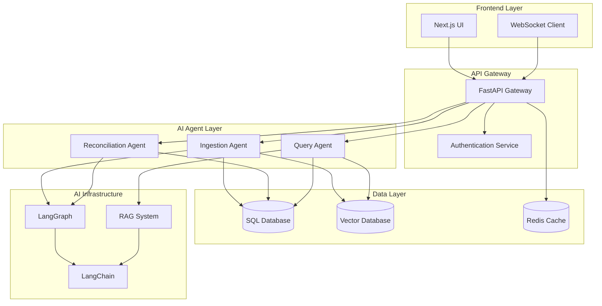

# Design Document

## Overview

This document outlines the design for a modernized AI agent web application that provides comprehensive financial data management, reconciliation, and analytics capabilities. The system leverages Next.js for the frontend, FastAPI for the backend, and integrates LangChain/LangGraph for AI orchestration with RAG-enhanced querying.

The application follows a microservices-inspired architecture with clear separation between authentication, data ingestion, reconciliation agents, and analytics dashboards, all unified under a modern green, black, and white design theme.

## Architecture

### High-Level Architecture



### Technology Stack

- **Frontend**: Next.js 14+ with TypeScript, Tailwind CSS
- **Backend**: FastAPI with Python 3.11+
- **AI Framework**: LangChain + LangGraph for agent orchestration
- **Databases**: PostgreSQL (SQL), ChromaDB (Vector), Redis (Cache)
- **Real-time**: WebSocket connections for live updates
- **Authentication**: JWT-based authentication with secure session management

## Components and Interfaces

### Frontend Components

#### 1. Authentication System
```typescript
interface AuthService {
  login(credentials: LoginCredentials): Promise<AuthResponse>
  logout(): Promise<void>
  refreshToken(): Promise<string>
  isAuthenticated(): boolean
}

interface LoginCredentials {
  username: string
  password: string
}

interface AuthResponse {
  access_token: string
  refresh_token: string
  user: UserProfile
}
```

#### 2. Main Dashboard with Carousel
```typescript
interface CarouselSection {
  id: 'data-management' | 'dashboard' | 'engine'
  title: string
  component: React.ComponentType
  icon: string
}

interface DashboardProps {
  sections: CarouselSection[]
  activeSection: string
  onSectionChange: (sectionId: string) => void
}
```

#### 3. File Upload Component
```typescript
interface FileUploadProps {
  acceptedTypes: string[]
  onUpload: (files: File[]) => void
  onProgress: (progress: UploadProgress) => void
  maxFileSize: number
}

interface UploadProgress {
  fileId: string
  fileName: string
  progress: number
  status: 'uploading' | 'processing' | 'complete' | 'error'
  currentStep: string
}
```

#### 4. Real-time Progress Component
```typescript
interface ProgressTracker {
  fileId: string
  steps: ProcessingStep[]
  currentStep: number
  overallProgress: number
}

interface ProcessingStep {
  id: string
  name: string
  status: 'pending' | 'active' | 'complete' | 'error'
  message?: string
  timestamp?: Date
}
```

### Backend API Interfaces

#### 1. Authentication Endpoints
```python
class AuthRouter:
    @post("/auth/login")
    async def login(credentials: LoginRequest) -> AuthResponse
    
    @post("/auth/logout")
    async def logout(token: str = Depends(get_current_user)) -> StatusResponse
    
    @post("/auth/refresh")
    async def refresh_token(refresh_token: str) -> TokenResponse
```

#### 2. File Upload and Processing
```python
class FileUploadRouter:
    @post("/upload")
    async def upload_file(
        file: UploadFile,
        user: User = Depends(get_current_user)
    ) -> UploadResponse
    
    @get("/upload/{file_id}/status")
    async def get_upload_status(file_id: str) -> ProcessingStatus
    
    @websocket("/upload/ws/{file_id}")
    async def upload_progress_websocket(websocket: WebSocket, file_id: str)
```

#### 3. Data Management Endpoints
```python
class DataRouter:
    @get("/data/transactions")
    async def get_transactions(filters: TransactionFilters) -> List[Transaction]
    
    @get("/data/rate-cards")
    async def get_rate_cards() -> List[RateCard]
    
    @get("/data/routing")
    async def get_routing_data() -> List[RoutingRule]
```

### AI Agent Interfaces

#### 1. Ingestion Agent (LangGraph)
```python
class IngestionState(TypedDict):
    file_id: str
    file_type: str
    content: Any
    classification: str
    confidence: float
    storage_decision: str
    processing_steps: List[str]

class IngestionAgent:
    def classify_data(self, state: IngestionState) -> IngestionState
    def normalize_data(self, state: IngestionState) -> IngestionState
    def store_data(self, state: IngestionState) -> IngestionState
```

#### 2. Reconciliation Agent (LangGraph)
```python
class ReconciliationState(TypedDict):
    transaction_data: List[Transaction]
    rate_card_data: List[RateCard]
    routing_data: List[RoutingRule]
    cost_analysis: CostAnalysis
    sla_analysis: SLAAnalysis
    routing_analysis: RoutingAnalysis

class ReconciliationAgent:
    def validate_costs(self, state: ReconciliationState) -> ReconciliationState
    def check_sla_compliance(self, state: ReconciliationState) -> ReconciliationState
    def analyze_routing(self, state: ReconciliationState) -> ReconciliationState
```

#### 3. Query Agent (RAG)
```python
class QueryAgent:
    def __init__(self, vector_store: VectorStore, sql_db: Database):
        self.retriever = vector_store.as_retriever()
        self.sql_db = sql_db
        self.rag_chain = self._build_rag_chain()
    
    async def process_query(self, query: str, user_context: dict) -> QueryResponse
    def _build_rag_chain(self) -> RunnableSequence
```

## Data Models

### Core Data Models

#### 1. Transaction Model
```python
class Transaction(BaseModel):
    id: str
    transaction_date: datetime
    settlement_date: datetime
    acquirer_name: str
    card_type: str
    network_type: str
    transaction_amount: Decimal
    mdr_percentage: Decimal
    mdr_cost: Decimal
    gross_settlement_cost: Decimal
    currency: str
    terminal_id: str
    created_at: datetime
    updated_at: datetime
```

#### 2. Rate Card Model
```python
class RateCard(BaseModel):
    id: str
    acquirer: str
    terminal_id: str
    payment_mode: str
    card_classification: str
    network: str
    card_category: str
    agreed_mdr_rate: Decimal
    applicable_sla_days: int
    sla_type: str  # T+1, T+2
    effective_date: datetime
    expiry_date: Optional[datetime]
```

#### 3. Routing Rule Model
```python
class RoutingRule(BaseModel):
    id: str
    terminal_id: str
    payment_method: str
    card_classification: str
    network: str
    primary_acquirer: str
    secondary_acquirer: str
    routing_priority: int
    is_active: bool
    created_at: datetime
```

#### 4. Reconciliation Result Model
```python
class ReconciliationResult(BaseModel):
    id: str
    transaction_id: str
    cost_validation: CostValidation
    sla_validation: SLAValidation
    routing_validation: RoutingValidation
    overall_status: str
    discrepancies: List[Discrepancy]
    created_at: datetime

class CostValidation(BaseModel):
    expected_mdr: Decimal
    actual_mdr: Decimal
    variance: Decimal
    is_valid: bool
    
class SLAValidation(BaseModel):
    expected_settlement_date: datetime
    actual_settlement_date: datetime
    sla_met: bool
    delay_days: int

class RoutingValidation(BaseModel):
    expected_acquirer: str
    actual_acquirer: str
    is_optimal: bool
    cost_impact: Optional[Decimal]
```

### Vector Store Models

#### Document Chunk Model
```python
class DocumentChunk(BaseModel):
    id: str
    document_id: str
    content: str
    metadata: dict
    embedding: List[float]
    chunk_index: int
    created_at: datetime
```

## Error Handling

### Error Response Structure
```python
class ErrorResponse(BaseModel):
    error_code: str
    message: str
    details: Optional[dict]
    timestamp: datetime
    request_id: str

class ValidationError(ErrorResponse):
    field_errors: List[FieldError]

class FieldError(BaseModel):
    field: str
    message: str
    invalid_value: Any
```

### Error Categories
1. **Authentication Errors**: Invalid credentials, expired tokens
2. **Validation Errors**: Invalid file formats, missing required fields
3. **Processing Errors**: AI agent failures, database connection issues
4. **Business Logic Errors**: Reconciliation failures, data inconsistencies

### Error Handling Strategy
- **Frontend**: Global error boundary with user-friendly messages
- **Backend**: Structured error responses with proper HTTP status codes
- **AI Agents**: Graceful degradation with fallback mechanisms
- **WebSocket**: Error event broadcasting with reconnection logic

## Testing Strategy

### Frontend Testing
```typescript
// Component Testing with React Testing Library
describe('FileUpload Component', () => {
  test('should handle file upload with progress tracking', async () => {
    // Test implementation
  })
  
  test('should display error for invalid file types', () => {
    // Test implementation
  })
})

// Integration Testing with Cypress
describe('Dashboard Flow', () => {
  test('should navigate through carousel sections', () => {
    // E2E test implementation
  })
})
```

### Backend Testing
```python
# Unit Testing with pytest
class TestIngestionAgent:
    def test_classify_transaction_data(self):
        # Test agent classification logic
        pass
    
    def test_handle_invalid_file_format(self):
        # Test error handling
        pass

# Integration Testing
class TestAPIEndpoints:
    def test_file_upload_flow(self):
        # Test complete upload and processing flow
        pass
    
    def test_websocket_progress_updates(self):
        # Test real-time updates
        pass
```

### AI Agent Testing
```python
# LangGraph Testing
class TestReconciliationGraph:
    def test_cost_validation_workflow(self):
        # Test graph execution with mock data
        pass
    
    def test_error_recovery_paths(self):
        # Test error handling in graph
        pass

# RAG Testing
class TestQueryAgent:
    def test_document_retrieval(self):
        # Test vector similarity search
        pass
    
    def test_query_response_accuracy(self):
        # Test end-to-end query processing
        pass
```

### Performance Testing
- **Load Testing**: Simulate concurrent file uploads and processing
- **Stress Testing**: Test system limits with large datasets
- **WebSocket Testing**: Verify real-time update performance under load
- **Database Testing**: Query performance optimization and indexing validation

This design provides a comprehensive foundation for building the AI agent web application with all the specified requirements, leveraging modern technologies and best practices for scalability, maintainability, and user experience.